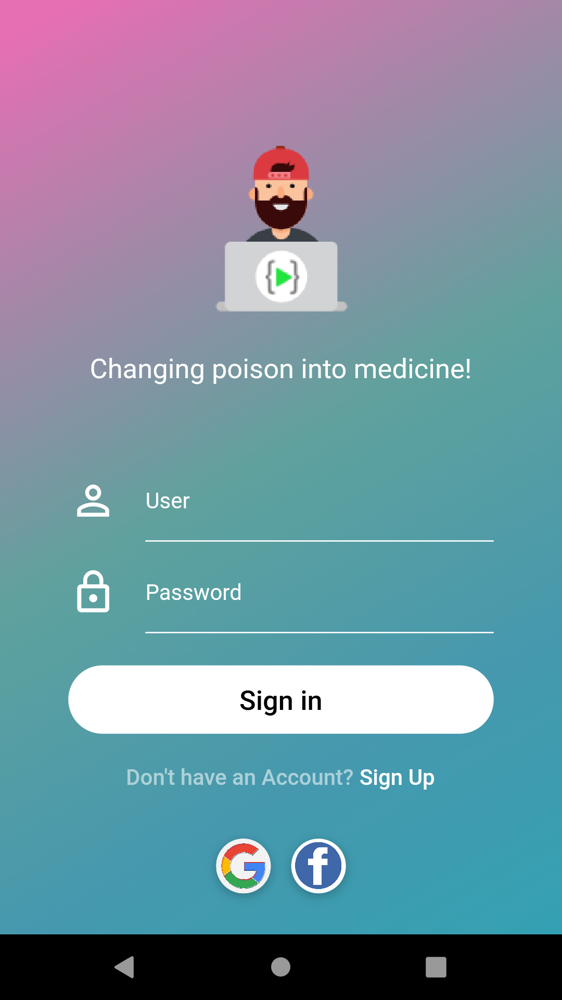
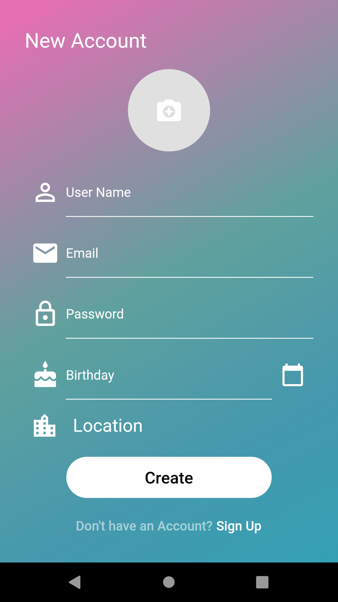
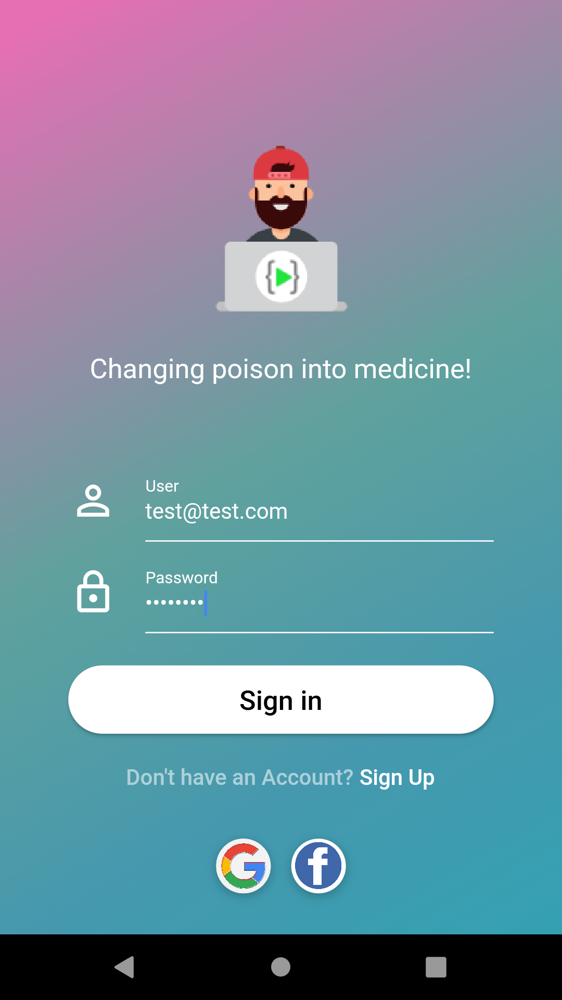
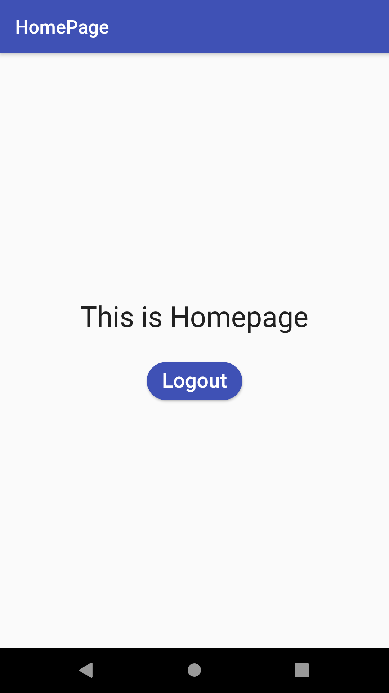
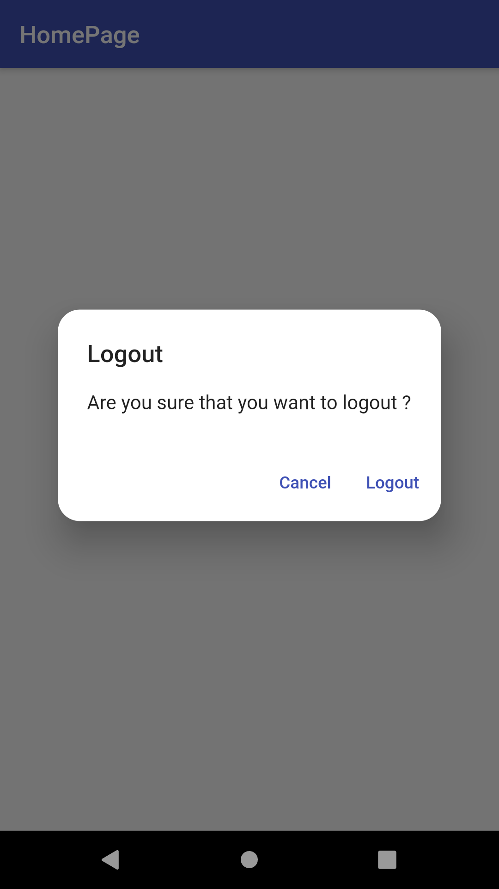
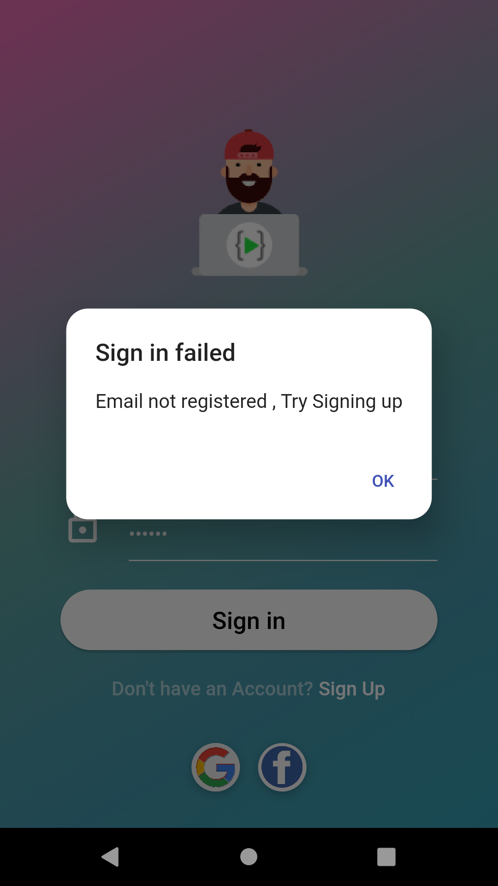
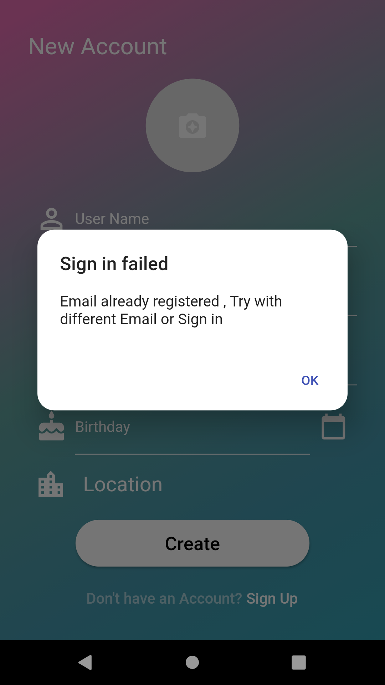
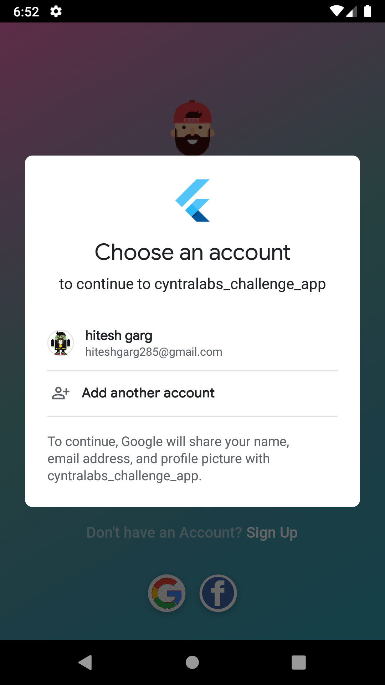
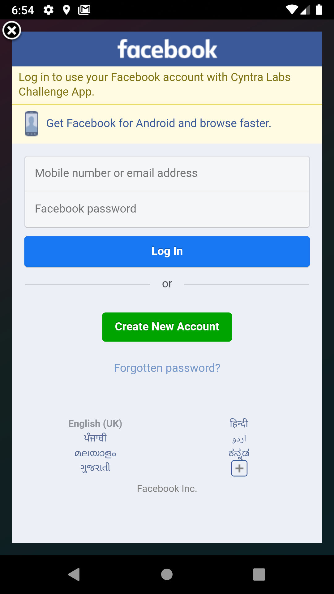

# CyntraLabs Challenge App

A Flutter project.

### Show some :heart: and star the repo to support the project

## Getting Started 🚀

- Clone the repo
- Install the dependicies
- Run it `flutter run`

## Features 📋

- Complete State Management with `Provider` package.
- Complete Sign-in , Sign-up flow.
- Google and Facebook Sign-in working.
- Good looking UI.
- Splash screen added.
- Complete Error handling.

## Notes 📝

- All the icons and images are arbitrary and can be changed.

## Preview 📸

|                                           |                                           |                                           |
| ----------------------------------------- | ----------------------------------------- | ----------------------------------------- |
|  |  |  |

|                                           |                                           |                                           |
| ----------------------------------------- | ----------------------------------------- | ----------------------------------------- |
|  |  |  |

|                                           |                                           |                                           |
| ----------------------------------------- | ----------------------------------------- | ----------------------------------------- |
|  |  |  |

## Contact me 📧

#### Email : hiteshgarg285@gmail.com
